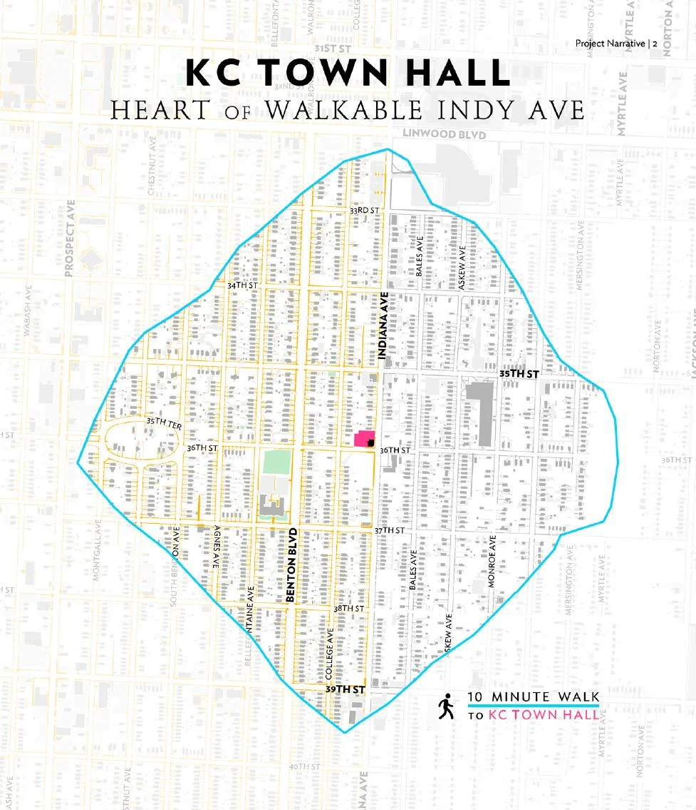

# KC Town Hall ten-minute-walk proposal map

## Public derivative

This derivative preserves the map and its project-planning argument while
removing the obsolete URL, email address, phone number, and social handle from
the proposal footer. Embedded metadata has been stripped.

## What it shows

The graphic locates KC Town Hall within a ten-minute walking area and makes a
neighborhood-scale constituency legible. It is evidence of a planning and
communication artifact, not proof that the proposed program was completed or
that every mapped premise was independently validated.

## Release boundary

Jamie explicitly authorized public-safe proposal graphics for portfolio use.
The original proposal remains protected because other pages include private,
financial, professional, contact, and depicted-person material. Clearing this
derivative does not clear the full bundle or the related photographs.
