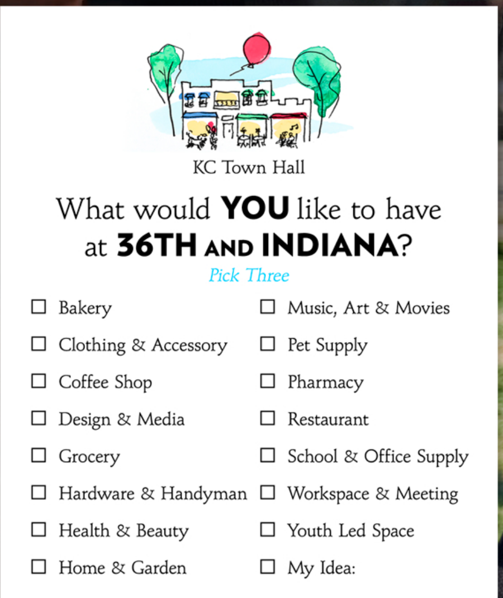
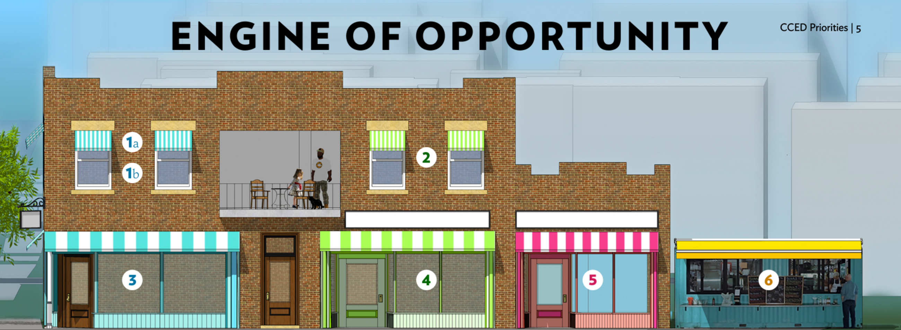

# KC Town Hall proposal public-safe visual excerpts

The underlying proposal contains sensitive information and remains outside
public Git. These crops retain only the blank public-participation prompt and
the adaptive-reuse rendering. They are evidence of proposal and communication
artifacts, not of community consensus or completed implementation.

Their exact case-study use and remaining human gates are recorded in the
[proposal-artifact projection](../projections/kc-town-hall-proposal-artifacts.md).
