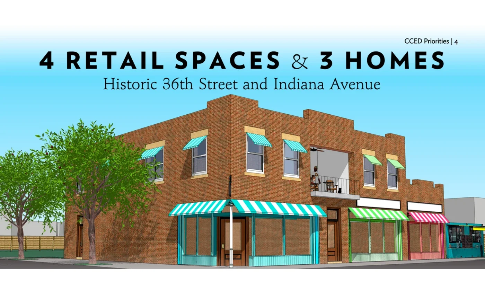

# KC Town Hall Mixed-Use Proposal Rendering

This derivative returns one public-safe visual from a proposal bundle that also
contains protected material. It shows the intended combination of four retail
spaces and three homes. It does not represent completed construction.

The crop is padded to the portfolio artifact ratio and stripped of embedded
metadata. No contact, financial, banking, personal, family, or support-letter
material is included.
