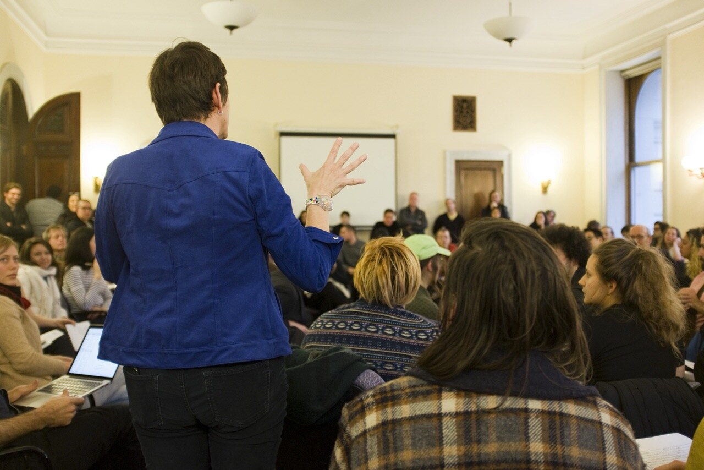

# DCLA DIY-spaces meeting, Layout A

## Current public use

The derivative appears beside the Technical Operations introduction. It gives
the role-fit page a scene of collective listening rather than treating
operational work as an abstract list of outputs.

## What is established

The derivative integrity and visible observations are governed. Contemporary
formation materials and first-person source return support the January 2017
DCLA meeting context. They do not resolve every participant's identity or role.

## What remains open

- exact private source binding;
- creator identity and permission;
- represented-person and visible-artwork review;
- final caption, credit, crop, staging, production, and indexing approval.
