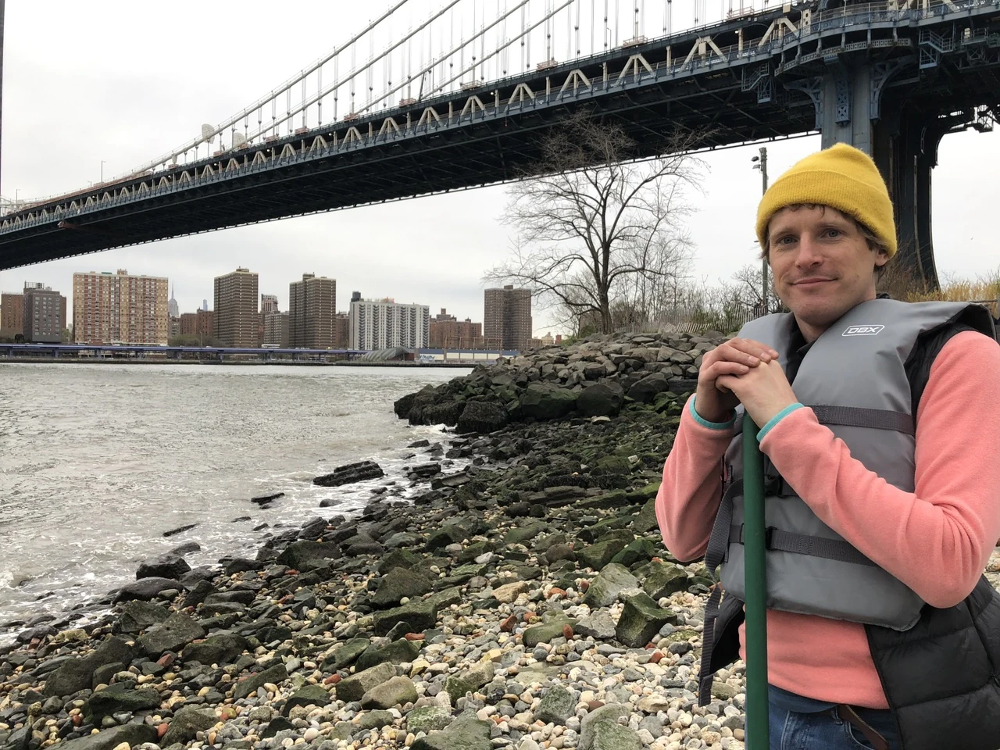

# East River beneath the Manhattan Bridge, 2022

## Current public use

The governed WebP appears as the Layout C homepage hero. A metadata-stripped
full-frame JPEG source is rendered with a 1200 by 630 cover crop inside the
homepage Open Graph preview. The homepage caption names the public place and
year and visibly credits Elana Gordon as photographer while naming Jamie
Burkart's photo archive as the custodian of this copy. Under Elana's explicit
optional-credit permission, the Open Graph pixels omit the credit while the
governed creator statement and permission capsule remain attached.

## What is established

- Creator: Elana Gordon.
- Capture year: 2022, at year precision.
- Public place label: East River beneath the Manhattan Bridge.
- Archive custody: Jamie Burkart's photo archive.
- Permission: bounded portfolio use summarized in a public-safe capsule; the
  private evidence remains outside Git.

## What it does not establish

The image is not evidence by itself of how often Jamie traveled by canoe, how
the canoe reached the shoreline, a professional role, or an outcome. A later
first-person recollection opened those questions without changing the homepage.

## Correction history

Layout C initially named only archive custody. On July 26, 2026, the preferred
creator statement and visible credit were corrected to name Elana Gordon. The
former missing-credit state remains legible as deprecated history rather than a
competing attribution.

On August 15, 2026, Jamie supplied protected correspondence showing that Elana
left visible credit or no visible credit to his preference for the authorized
portfolio use. The homepage credit remains visible; the governed Open Graph
occurrence now omits credit from its pixels and records that placement choice
without copying the private correspondence into Git.

## Open gates

Public Git and staging review are approved for this occurrence. Production
publication and indexing remain open decisions for Jamie. Revocation routes to
the occurrence record and rollback instructions rather than deleting this
historical asset record.
