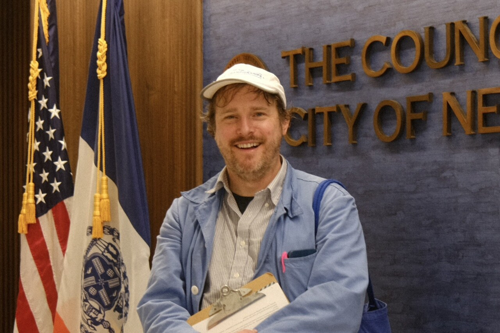

# Jamie Burkart in a Council chamber, Layout A

## Current public use

The exact derivative above appears as the Layout A homepage hero. The current
composition provides personal presence before the text names Jamie's role and
operating practice.

## What is established

- The derivative checksum, dimensions, path, and metadata-stripped status match
  the governed branch-review register.
- Jamie is the depicted person.
- The visible setting is a Council chamber.
- The derivative is held in Jamie's photo archive.

Archive custody is not creator attribution.

## Returned source manifestation

Jamie returned a second 1280 x 854 JPEG manifestation on July 26, 2026. It is
visually the same frame but has a different checksum and retains a limited EXIF
envelope. The file is recorded in the oral-history source record and remains
outside public Git. The existing metadata-stripped derivative remains
canonical for branch review.

## What remains open

- photographer identity and permission scope;
- exact private source binding;
- exact packet version, recipients, conversations, and follow-up;
- visible-artwork and represented-person review;
- final caption, credit, and crop;
- staging, production, and indexing approval.

Contemporary event records now corroborate the official session, date, venue,
and organizer. Jamie's oral history describes the participation materials and
proposal he carried. The combined record supports the bounded branch-review
caption without establishing delivery, institutional response, outcome,
creator identity, or production permission.

## Curatorial boundary

The photograph can create presence, readiness, and public-institution context.
Those are compositional functions, not factual proof that the image documents
the professional claims placed beside it.
