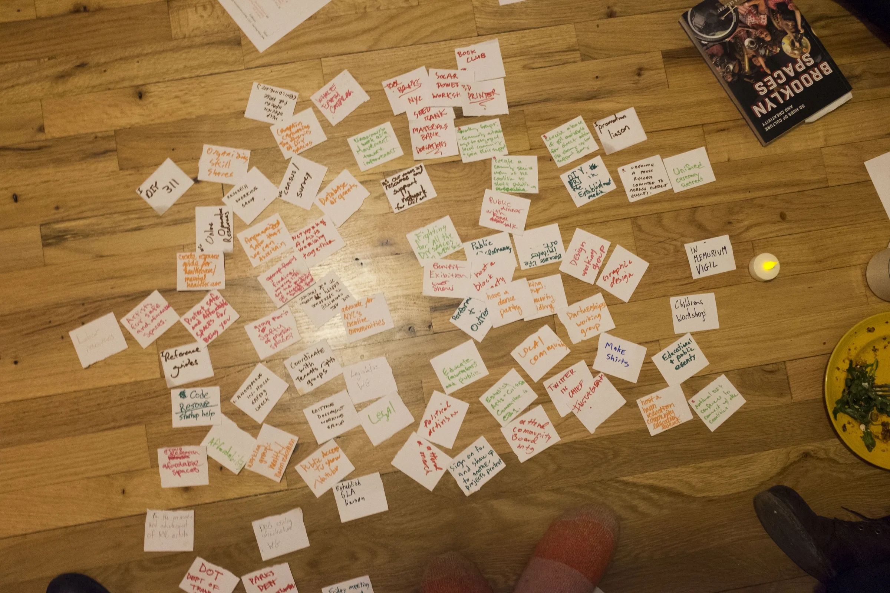

# NYC Artist Coalition shared working map, 2017

## Current public use

The metadata-stripped derivative appears on the Knowledge Wiki Graphs page as
an intuitive material trace of collective sense-making. The public display
credit is "Photo courtesy of NYC Artist Coalition."

## Evidence boundary

The photograph shows handwritten contributions made visible together. The
portfolio uses that visible action to introduce a method that begins with
knowledge already present in people, language, artifacts, and relationships.
The image alone does not establish authorship, exact discussion, agreement,
ownership, adoption, or outcome.

## Human decision

On August 21, 2026, Jamie identified the designated album as cleared for the
portfolio, asked for this project image to be selected and used, and directed
staging and production deployment of the exact derivative and occurrence.
