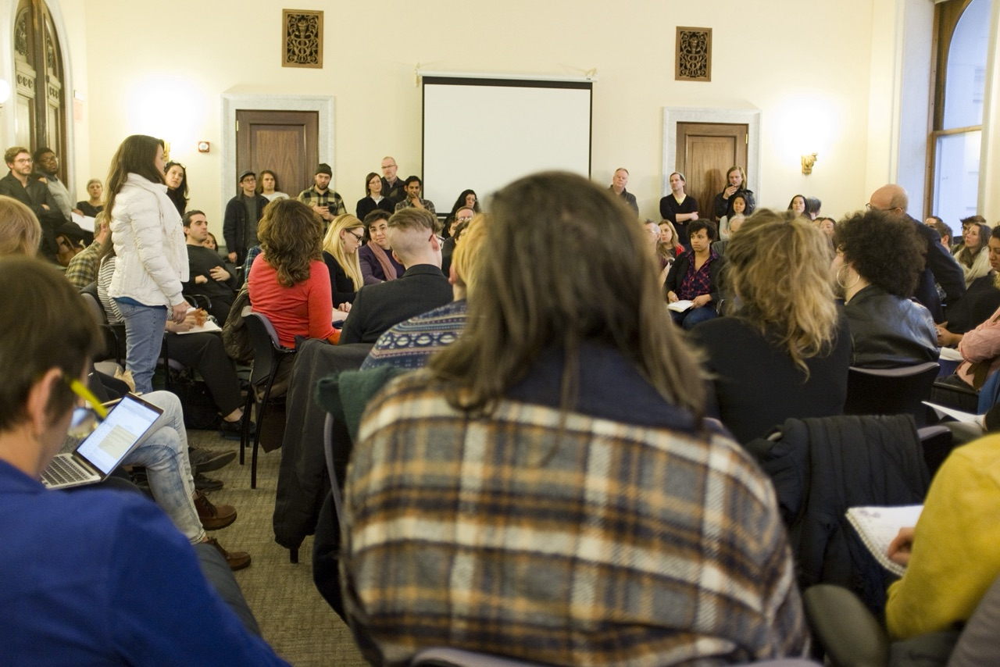

# DCLA Listening-Room Photograph

The photograph documents a room listening and taking notes during the January
2017 DCLA meeting. Jamie identifies the standing participant as Jenny Dubnau of
the Artist Studio Affordability Project. That identification is a dated
first-person source; the photograph does not preserve her remarks.

The committed derivative is an adjacent frame from the same meeting sequence,
not the blue-jacket, rear-view frame that initiated the oral-history return.
The Wiki keeps the shared event context while recording visible details per
frame rather than blending the sequence into one imagined photograph.

The photographer, exact credit line, and represented-person review remain open.
The committed derivative is available for branch review under the current
portfolio hold. Repository presence is not production clearance.
