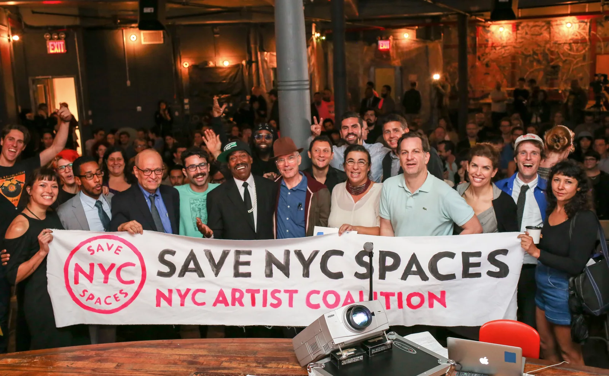

# Office of Nightlife town hall at Market Hotel, 2017

The selected derivative places lived coalition scale beside the public
FairRentNYC surface. Jamie authorized portfolio publication from the source
album. Public use credits NYC Artist Coalition as the source archive because
the available creator metadata conflicts and no creator attribution has been
resolved.

The caption does not name every person or publish an unverified attendance
count. It keeps the meeting and its outcomes collective.
