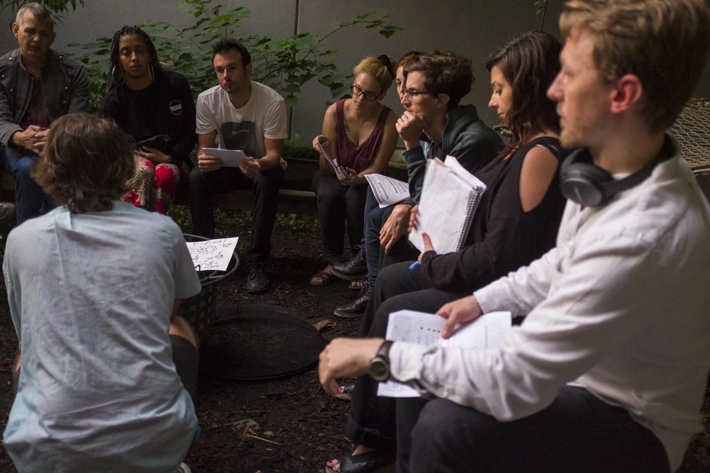

# Facilitating at Shoestring Press, 2017

The selected derivative makes Jamie's facilitation practice visible and pairs
it with the common Let NYC Dance public surface. A public Flickr occurrence
supports the meeting title and capture date. Jamie's memory that the meeting
produced agreement around a shared domain and mailing list remains a research
lead, not a confirmed caption claim.
