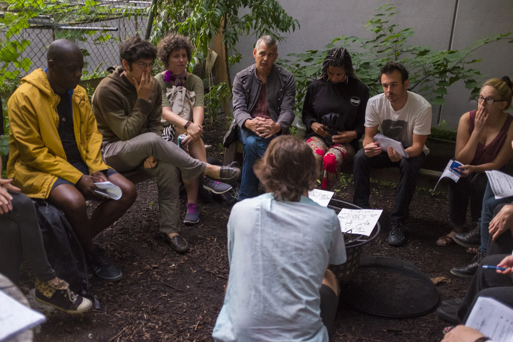

# Shoestring Press coalition working session, 2017

## Current public use

The metadata-stripped derivative appears in the Fair Rent NYC case study as
the working-alignment image in a three-part participation sequence. The public
display credit is "Photo courtesy of NYC Artist Coalition."

## Evidence boundary

The frame makes Jamie's facilitation visible. Jamie's account supplies the
recollection that participating groups aligned around a shared campaign site
and email list; retained repository histories separately support his web
implementation role. The photograph alone does not establish that agreement.

## Open gates

Public Git and staging review are approved for this exact occurrence.
Production publication and indexing remain open decisions for Jamie.
