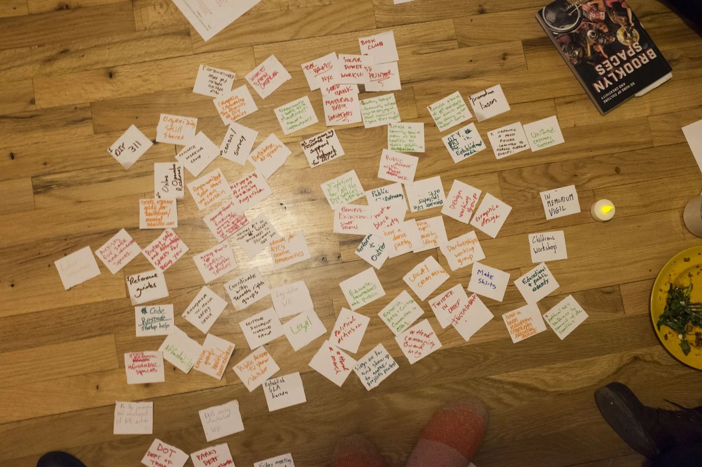

# NYC Artist Coalition steering-group card field, 2017

The selected derivative makes an otherwise invisible part of team knowledge
work visible: people putting their own language into relation. Its use on the
Source-Backed Team Memory lab is interpretive rather than evidentiary proof of
the later software architecture.
