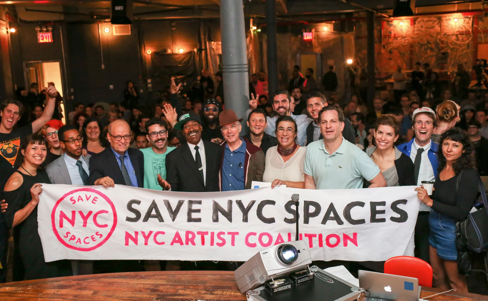

# Save NYC Spaces banner at Market Hotel, 2017

## Source return and current use

The archived-project-site census first preserved this image family in a held
state. Jamie's album-scoped authorization, creator review, exact derivative,
caption review, and destination review now support one bounded occurrence in
the Fair Rent NYC case study. Paul Mossine is credited as photographer.

## Evidence boundary

The image makes the public room visible. It is not an attendance record, a
complete participant roster, an endorsement ledger, or evidence that any one
person caused the campaign or its policy outcomes.

## Open gates

Public Git and staging review are approved for this exact occurrence.
Production publication and indexing remain open decisions for Jamie.
